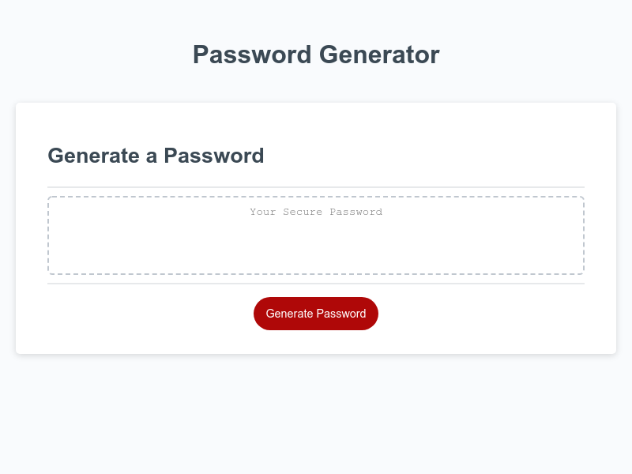

# Password Generator

# Details:

The Password Generator tool allows user to randomly generate a password based on parameters they choose.

Parameters:
Length between 8 - 128 characters
Choice to include 1 or more of:
-lower case letters
-upper case letters
-numbers
-special characters (!@#$% etc.)

An error is thrown if the length chosen is outside of the allowed length, or length is not a number, or if no characters are chosen. 

# URL: 

https://genkidesu.github.io/apps/passwordgen.html

# Mock Up:

