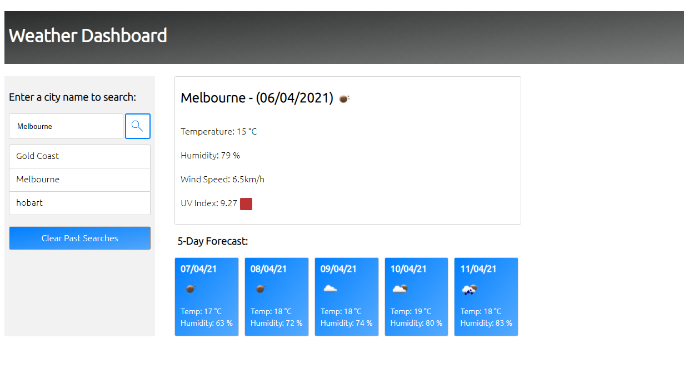

# Weather Dashboard

# Details:

Task was to make a weather dashboard which will take a city, return 5 day forecast, and save the city for easy search later.

Note: From next assignment I will be creating new repository for each assignment as per last homework feedback I received. I had already uploaded this assignment before seeing the feedback but from next week I will move to seperate repositories.

# URL: 

https://genkidesu.github.io/weatherdashboard/dashboard.html

# Mock Up:

